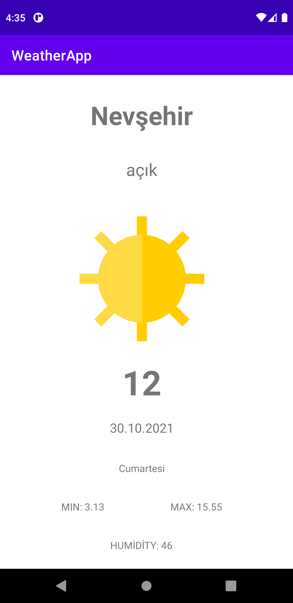
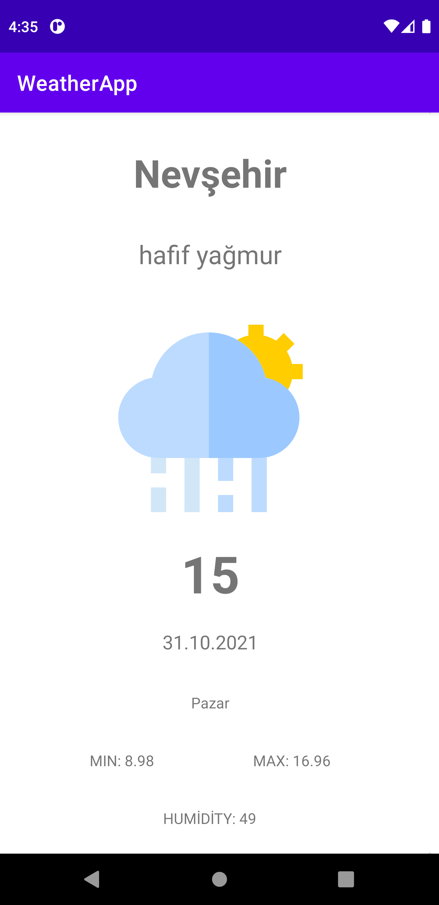
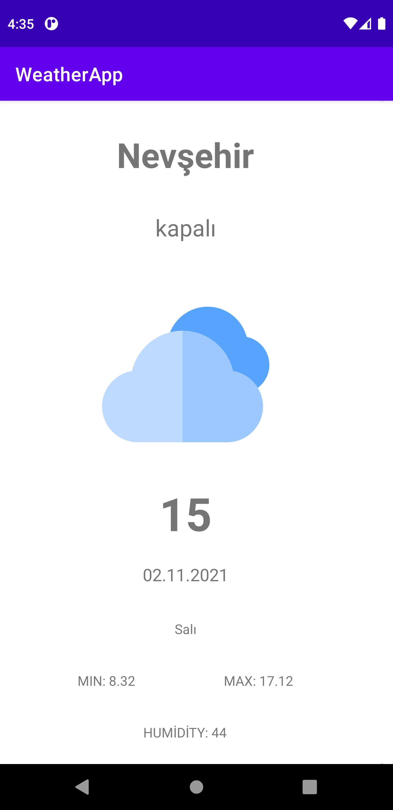

# WeatherApp

<h3>Libraries used in this project<h3>
<ul>
  <li><a href="https://square.github.io/retrofit/" target="_blank">Retrofit</a></li>
  <li><a href="https://github.com/google/gson" target="_blank">GSon</a></li>
  <li><a href="https://square.github.io/picasso/" target="_blank">Picasso</a></li>
  <li><a href="https://github.com/coil-kt/coil" target="_blank">Coil</a></li>
 </ul>
 <h4>APİ RESOURCE <a href="https://collectapi.com/tr/api/weather/hava-durumu-api" target="_blank">CollectAPI</a></h4>

 

 

